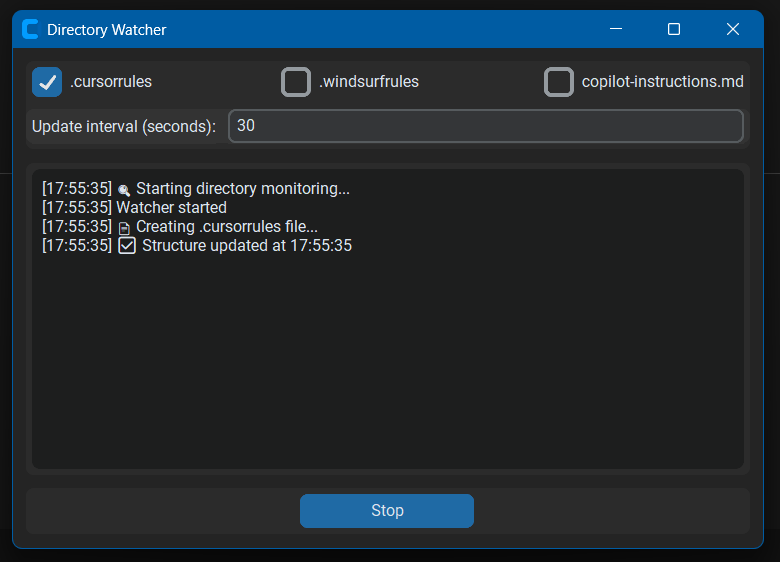

# 🔍 Directory Watcher

A lightweight, modern tool for real-time directory structure monitoring and documentation. Perfect for developers using Cursor IDE, Windsurf, or GitHub Copilot.

## 📺 Watch the Demo & Tutorial

<div align="center">

[](https://www.youtube.com/watch?v=rzwATkD5daM)
  
</div>

## ✨ Features

- 🔄 **Real-time Monitoring**: Automatically tracks directory changes
- 🎯 **Multi-Format Support**: 
  - `.cursorrules` for Cursor IDE
  - `.windsurfrules` for Windsurf
  - `copilot-instructions.md` for GitHub Copilot
- 🌟 **Modern GUI**: User-friendly interface with dark/light mode support
- ⚡ **Lightweight**: No external dependencies beyond the UI
- 🛡️ **Smart Filtering**: Respects `.gitignore` rules
- 🎛️ **Configurable**: Adjustable update intervals and file selection

## 📥 Installation & Usage

### Windows Users (Recommended)
1. Download the latest release:
   - [📦 DirectoryWatcher.exe](https://github.com/MrIagoUFV/DirectoryWatcher/releases/latest)
2. Run the executable
3. That's it! No installation needed.

### From Source
If you prefer running from source, you only need three files:
```
📁 Your Project
 ├── 📄 gui.py      # GUI implementation
 ├── 📄 watcher.py  # Core functionality
 └── 📄 requirements.txt
```

1. Install dependencies:
```bash
pip install -r requirements.txt
```

2. Run the application:
```bash
# GUI Mode (Recommended)
python gui.py

# OR Command Line Mode
python watcher.py
```

## 🖥️ Interface Guide



1. **File Selection**: Choose which files to update
   - `.cursorrules` - For Cursor IDE integration
   - `.windsurfrules` - For Windsurf integration
   - `copilot-instructions.md` - For GitHub Copilot integration

2. **Update Interval**: Set how often to check for changes (in seconds)

3. **Log Area**: Real-time monitoring status and updates

4. **Control**: Start/Stop monitoring with a single click

## 📄 Generated Files

### .cursorrules & .windsurfrules
```json
{
    "directory-structure": {
        "src": {
            "main.py": null,
            "utils": {
                "helper.py": null
            }
        },
        "tests": {},
        "README.md": null
    }
}
```

### copilot-instructions.md
```markdown
# Copilot Instructions

This file contains instructions for GitHub Copilot about the project structure.

## Project Structure

```json
{
    "directory-structure": {
        // Same structure as above
    }
}
```

### Why JSON?

(TLDR: Cursor recommends JSON)

Why do `.cursorrules` and `.windsurfrules` files use JSON format?

JSON was chosen for being a universal format, easily parseable by AIs, human-readable, and compatible with all programming languages, allowing a clear and hierarchical structure to define project rules and configurations. 

## 🛠️ Technical Details

- **Language**: Python 3.8+
- **GUI Framework**: CustomTkinter
- **File Monitoring**: Native Python file system operations
- **Pattern Matching**: fnmatch for .gitignore support

## 🎯 Use Cases

- 📚 **Documentation**: Keep project structure documentation always up-to-date
- 🤖 **AI Integration**: Enhance AI tools' understanding of your project
- 🔄 **Version Control**: Track structural changes over time (if you use git)
- 🎓 **Project Overview**: Quick visualization of project organization

## 💡 Inspiration

This project was inspired by [CursorFocus](https://github.com/RenjiYuusei/CursorFocus) by RenjiYuusei, but takes a different approach:

- **Simplified**: Focused solely on directory structure monitoring
- **No API Dependencies**: Works offline, no API keys needed
- **Modern GUI**: Added user interface for easy configuration
- **Multi-Format**: Supports multiple documentation formats

## 🤝 Contributing

Contributions are welcome! Feel free to:
- Report bugs
- Suggest features
- Submit pull requests

## 📝 License

Este projeto está sob uma Licença Personalizada que proíbe uso comercial e requer atribuição para modificações. Veja o arquivo [LICENSE](LICENSE) para mais detalhes.

## 🇧🇷 Fala português?

Quer aprender mais sobre programação com IA e ficar por dentro das novidades? 

- 📺 **Me acompanhe no YouTube**: [@mriago](https://www.youtube.com/@mriago) - Canal focado em programação e Inteligência Artificial
- 💬 **Entre na nossa Comunidade**: [Grupo no WhatsApp](https://chat.whatsapp.com/CP7zu5ebSRY2RCiq5g8Slu) - Compartilhe experiências e aprenda com outros desenvolvedores

---
